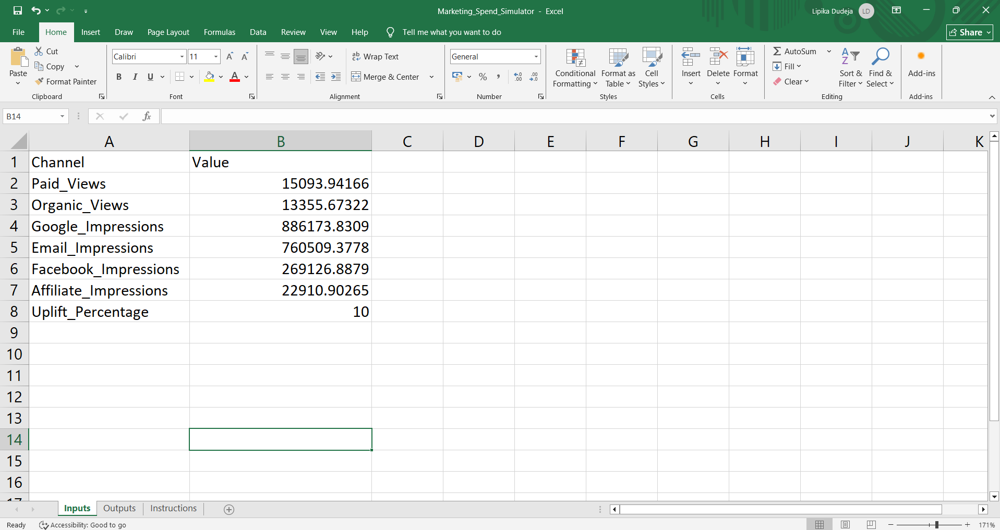
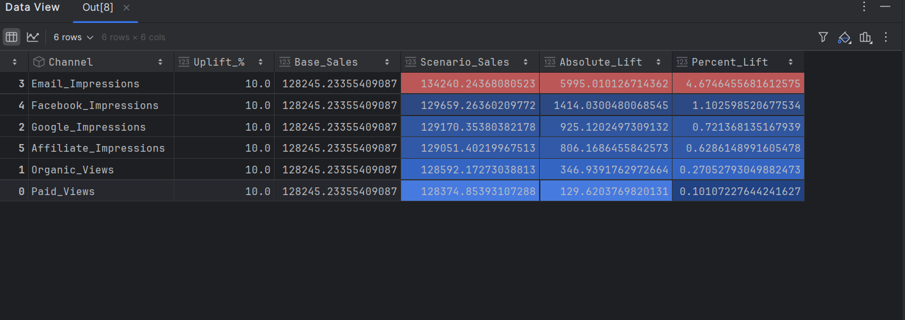
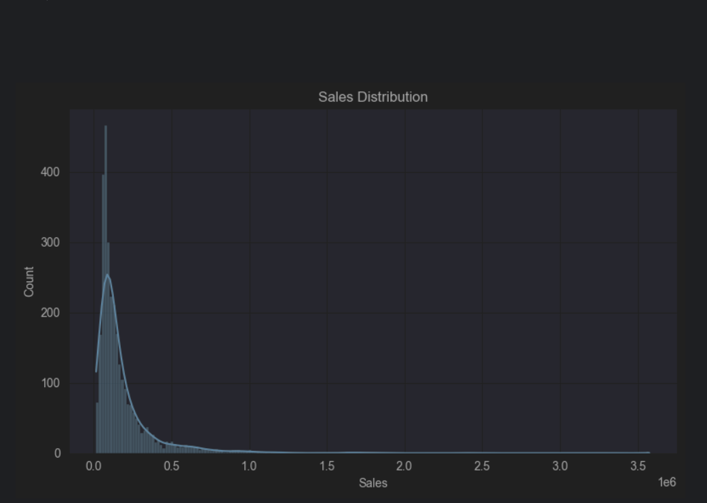

# Marketing Spend Optimization

## Business Problem
Understand how different marketing channels impact sales and build a decision-support system to simulate changes in marketing spend.

## Dataset
Weekly marketing performance data including:
- Paid Views
- Organic Views
- Google, Facebook, Email & Affiliate Impressions
- Sales (target)

## Approach
1. Business understanding & KPI definition
2. Exploratory Data Analysis (EDA)
3. Correlation & multicollinearity analysis (VIF)
4. Baseline Linear Regression
5. Log-transformed Linear Regression (improved performance)
6. Model evaluation (R², RMSE)
7. Scenario simulation (What-if analysis)

## Key Insights
- Google, Facebook, and Email impressions show strong correlation with sales
- No severe multicollinearity (VIF < 10)
- Log transformation improves model stability and interpretability

##  Project Screenshots

### Excel-Based Decision Support Tool – Inputs

### Excel-Based Decision Support Tool – Outputs

### Marketing Channel Simulation Results

### Sales Distribution (EDA)

## Tech Stack
Python, Pandas, NumPy, Scikit-learn, Statsmodels, Matplotlib, Seaborn

## Output
- Trained regression model
- Simulation-ready notebook
- Excel-based decision support (WIP)
